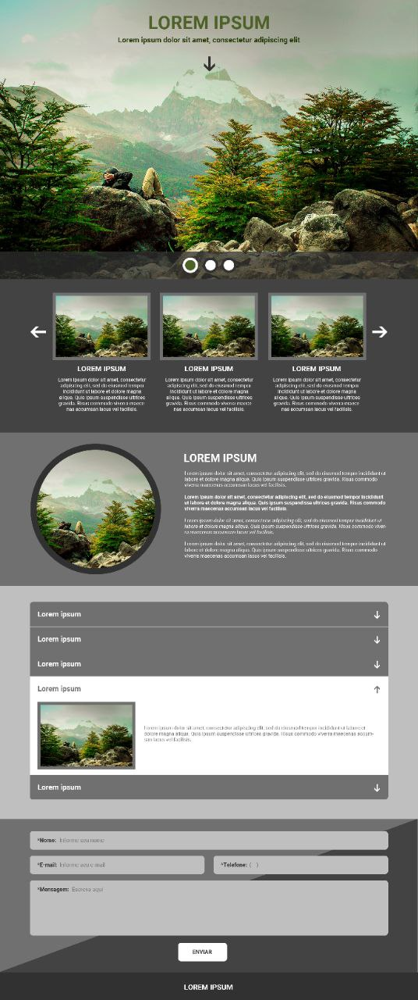

# dot-front-end-challenge

> Desafio técnico para desenvolvedor Front-End na Upnid

## Requisitos

- 🧰 Framework → uma versão fazendo uso de um framework, sendo ele Vue ou React
- 🛠️ Vanilla → uma versão sem uso de qualquer framework, apenas com ferramentas web nativas
- 🥤 Gulp → fazer uso de Gulp como o task runner (automatizador de tarefas) do projeto
- 📱 Responsividade → a aplicação pode ser usada em um dispositivos móveis

## Executando o projeto

instale as dependências do projeto (de preferência, com `yarn` a fins de evitar conflitos com o `npm`)

Yarn:

```
$ yarn
```

npm:

```
$ npm i
```

Após instaladas, teremos que inicializar o servidor de desenvolvimento, execute o comando `gulp:front-vue` para inicializar o Frontend em Vue, caso contrário, execute `gulp:front-vanilla` para o Frontend sem framework (ambos os scripts estão presentes no package.json e devem ser chamados com `yarn` ao invés de `npm`):

```
# Frontend Vue
$ yarn gulp:front-vue

# Frontend sem framework
$ yarn gulp:front-vanilla
```

## Layout

### Desktop



### Mobile


